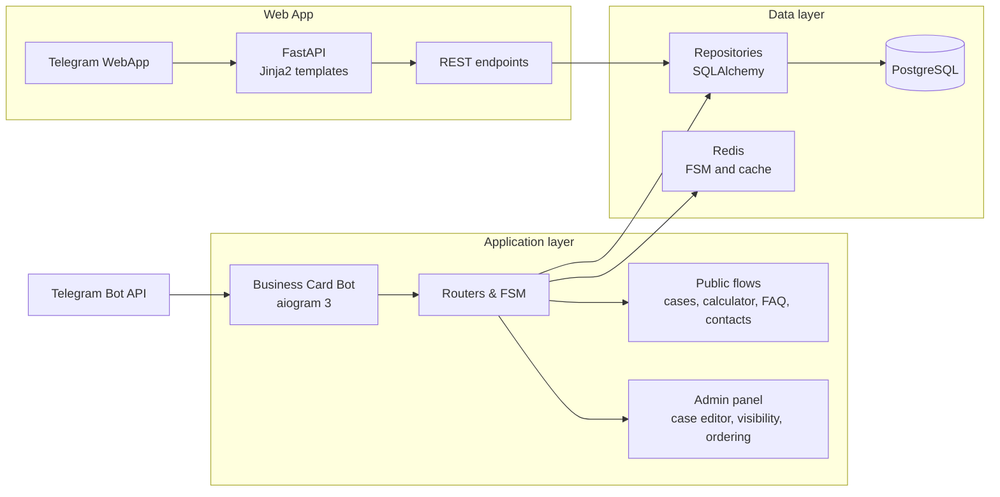
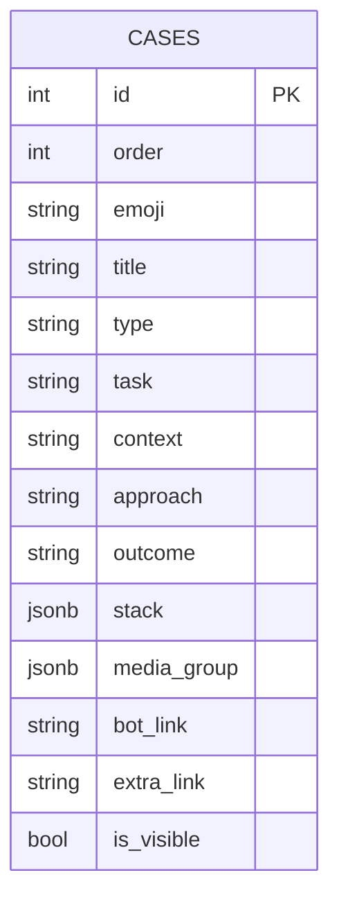

<h1 align="center">📱 Business Card</h1>

<p align="center">
<strong>Telegram-бот-портфолио с Web App, админ-панелью и калькулятором стоимости</strong>
</p>

<p align="center">
Бот-визитка + Telegram Web App в одном процессе. Кейсы, калькулятор стоимости, FAQ и контакты
</p>

---

## 📌 О проекте

Business Card Bot — Telegram-бот и Web App для демонстрации портфолио разработчика. Клиенты листают кейсы, считают стоимость проекта через интерактивный калькулятор, читают FAQ и связываются через каналы. Владелец управляет контентом через админ-панель в Telegram.

## 🧭 Карта возможностей

- **👤 Посетители:** Портфолио-карусель, калькулятор стоимости, FAQ, контакты и ссылки.
- **🌐 Web App:** Веб-интерфейс внутри Telegram — те же сценарии с собственным дизайном.
- **👨‍💼 Администратор:** FSM-редактор кейсов, управление видимостью, сортировка и удаление.

## ✨ Основные сценарии

| Направление | Что автоматизирует |
| :--- | :--- |
| **Портфолио** | Карусель кейсов с медиа, стеком, ссылками и описанием (Контекст → Подход → Результат). |
| **Калькулятор** | Пошаговый расчёт стоимости: тип бота → интеграции → админка → дедлайн. FSM в боте, server-driven в Web App. |
| **FAQ** | Интерактивный чат-симулятор в Web App, классический список в боте. |
| **Контакты** | Telegram, GitHub, Max, телефон — всё из конфигурации. |
| **Админ-панель** | Добавление, редактирование, удаление и сортировка кейсов через FSM. Доступ по `ADMIN_IDS`. |

## 🛠 Технологический стек

| Слой | Технологии | Назначение |
| :--- | :--- | :--- |
| **Bot runtime** | Python 3.11+, aiogram 3.x | Асинхронная работа с Telegram Bot API. |
| **Web App** | FastAPI, Jinja2, vanilla CSS | HTML-интерфейс внутри Telegram WebApp. |
| **Данные** | PostgreSQL 16, asyncpg, SQLAlchemy 2, Alembic | Основное хранилище, ORM и миграции. |
| **Состояния** | Redis 7, aiogram FSM | Кэш, состояние диалогов и сессии. |
| **Конфигурация** | python-dotenv, pydantic-settings | Загрузка `.env` и типизированные настройки. |
| **Логирование** | Loguru | Структурированное логирование. |
| **Деплой** | Docker, Docker Compose | Контейнеризация и запуск на VPS. |
| **Качество** | pytest, pytest-asyncio | Автотесты бизнес-логики. |

## 🔌 Внешние интеграции

| Интеграция | Где используется |
| :--- | :--- |
| **Telegram Bot API** | Основной интерфейс для посетителей и администратора. |
| **Telegram WebApp SDK** | Web App открывается внутри Telegram, использует нативную тему. |

## 📐 Архитектура



## 🗄 Модель данных



## 📂 Структура проекта

```text
├── app/
│   ├── bot/            # Телеграм-бот: роутеры, клавиатуры, тексты, middleware
│   ├── db/             # SQLAlchemy-модели, репозитории, сессии
│   ├── services/       # Бизнес-логика: калькулятор, кейсы, FAQ, редактор
│   ├── webapp/         # FastAPI: роуты, Jinja2-шаблоны, статика
│   ├── migrations/     # Alembic-миграции
│   ├── config.py       # Pydantic Settings (парсинг .env)
│   └── main.py         # Точка входа: Aiogram + FastAPI в одном процессе
├── scripts/            # Скрипты разработки (dev.ps1)
├── tests/              # Pytest-тесты
├── docker-compose.yml  # PostgreSQL + Redis + Bot
├── Dockerfile          # Docker-образ приложения
├── alembic.ini         # Конфигурация миграций
└── pyproject.toml      # Метаданные и зависимости
```

## 🚀 Быстрый старт через Docker

```bash
git clone https://github.com/ProstoiKot12/Business-card.git
cd Business-card

cp .env.example .env
docker compose up -d --build
docker compose exec bot alembic upgrade head
```

Заполните `.env`: токен Telegram-бота (`BOT_TOKEN`), `ADMIN_IDS`, `OWNER_ID`, ссылки владельца и подключение к PostgreSQL и Redis.

## 💻 Локальная разработка

В dev-режиме бот запускается локально из `.venv`, а в Docker поднимаются только PostgreSQL и Redis:

```powershell
.\scripts\dev.ps1
```

Скрипт автоматически:
- создаёт `.venv`, если его ещё нет;
- ставит зависимости `.[dev]` при первом запуске или при изменении `pyproject.toml`;
- поднимает PostgreSQL и Redis через `docker compose up -d`;
- применяет миграции Alembic, если изменились migration-файлы;
- запускает `python -m app.main` локально.

Принудительное обновление зависимостей или миграции:

```powershell
.\scripts\dev.ps1 -Install
.\scripts\dev.ps1 -Migrate
```

## 🧪 Проверки качества

```bash
python -m compileall app tests
pytest -q
```

## 📸 Скриншоты

> Скрины будут добавлены позже

| Экран | Что показать |
| :--- | :--- |
| Главное меню бота | |
| Карусель кейсов | |
| Калькулятор стоимости | |
| FAQ чат-симулятор | |

## ⚙️ Деплой

Проект рассчитан на запуск на VPS через Docker Compose. Бот работает через Long Polling; FastAPI принимает Web App запросы на порту 8000.

```bash
docker compose up -d --build
docker compose exec postgres pg_isready -U bot
docker compose exec bot alembic upgrade head
```
